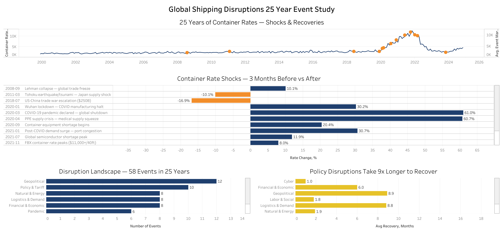
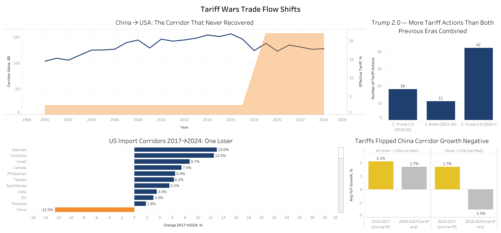
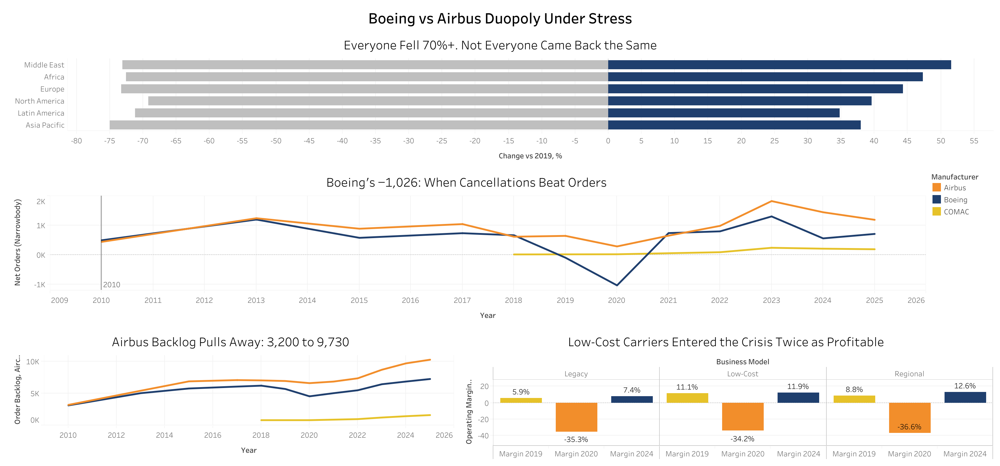
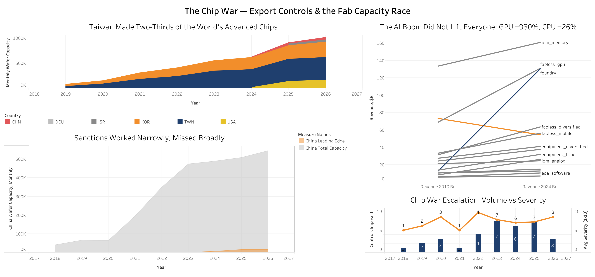

# Supply Chain Analytics Portfolio
A collection of supply chain and trade analytics projects, built to demonstrate analytical skills on disruption impact, trade policy, and industry dynamics using multi-table datasets.

## ⭐️ About
This portfolio showcases supply chain analytics work including disruption event studies, freight rate analysis, trade policy impact, and industry risk assessment — targeting Supply Chain Analyst and Industry/Market Analyst roles.

## ⭐️ Stack
- **SQL** (SQLite) — data extraction, window functions, event-study joins
- **Tableau Public** — interactive dashboards
- **GitHub** — version control and portfolio hosting

---

## ⭐️ Cases

### [Case 01 — Global Shipping Disruptions: 25-Year Event Study](case-01-shipping-disruptions-event-study/README.md)
Event study of 58 major supply chain disruptions (2001–2025) and their impact on container shipping rates — quantifying shock magnitude and recovery time by disruption type. Policy disruptions recover 9x slower than physical shocks.
> Tools: SQL · Tableau Public
> Dataset: 300 monthly rate records + 58 disruption events | 2000–2024 | 8 disruption families

🔗 [View Dashboard](https://public.tableau.com/views/GlobalShippingDisruptions25YearEventStudy/Dashboard1)

---

### [Case 02 — Tariff Wars & Trade Flow Shifts](case-02-tariff-wars-trade-flows/README.md)
How three waves of US tariff policy reshaped 50 trade corridors — 71 real policy events against 25 years of corridor flows. Trump 2.0 fired more tariff actions than both previous eras combined; the China corridor flipped to negative growth while Mexico gained +27.8%.
> Tools: SQL · Tableau Public
> Dataset: 71 tariff policy events + 1,250 corridor-year records | 50 corridors | 2000–2026

🔗 [View Dashboard](https://public.tableau.com/views/TariffWarsTradeFlowShifts/Dashboard1)

---

### [Case 03 — Boeing vs Airbus: A Duopoly Under Stress](case-03-boeing-airbus-duopoly/README.md)
The commercial aviation duopoly through the 737 MAX crisis and COVID — Boeing's net orders went negative twice (−87, −1,026) while the Airbus backlog pulled away from near-parity to a 2,850-aircraft lead. Recovery split sharply by region and business model.
> Tools: SQL · Tableau Public
> Dataset: 4 aviation tables | 30 airlines | 17 years | 2010–2026

🔗 [View Dashboard](https://public.tableau.com/views/BoeingvsAirbusDuopolyUnderStress/Dashboard1)

---

### [Case 04 — The Chip War: Export Controls & Fab Capacity Race](case-04-chip-war-export-controls/README.md)
34 export control actions measured against what actually happened to fab capacity. Taiwan produced up to 63.9% of the world's advanced chips; sanctions held China's leading-edge capacity near zero while its total capacity grew 13× — a narrow success and a broad miss.
> Tools: SQL (window functions, CTE joins) · Tableau Public
> Dataset: 3 semiconductor tables | 40 companies | 34 control events | 2010–2026

🔗 [View Dashboard](https://public.tableau.com/views/TheChipWarExportControlsFabCapacityRace/Dashboard1)

---

## ⭐️ Dashboards Preview

| Case | Dashboard |
|---|---|
| Global Shipping Disruptions |  |
| Tariff Wars & Trade Flows |  |
| Boeing vs Airbus Duopoly |  |
| The Chip War |  |
